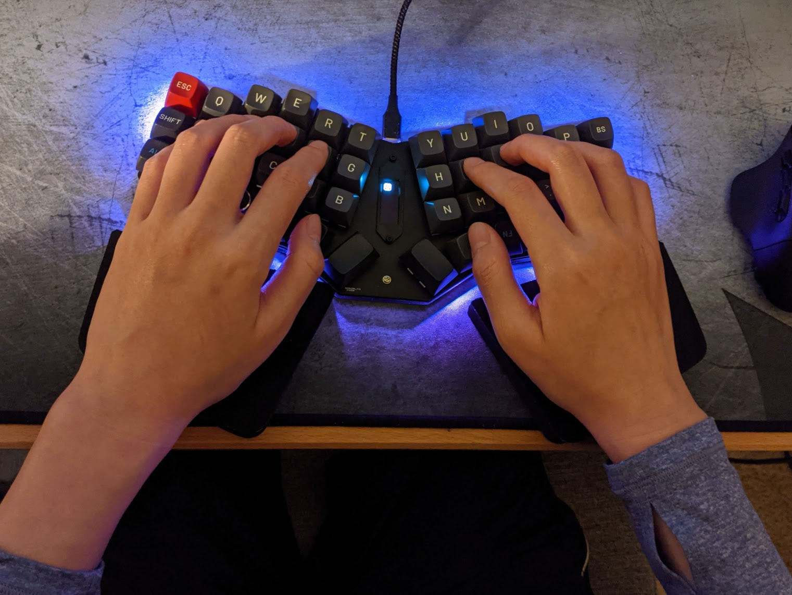
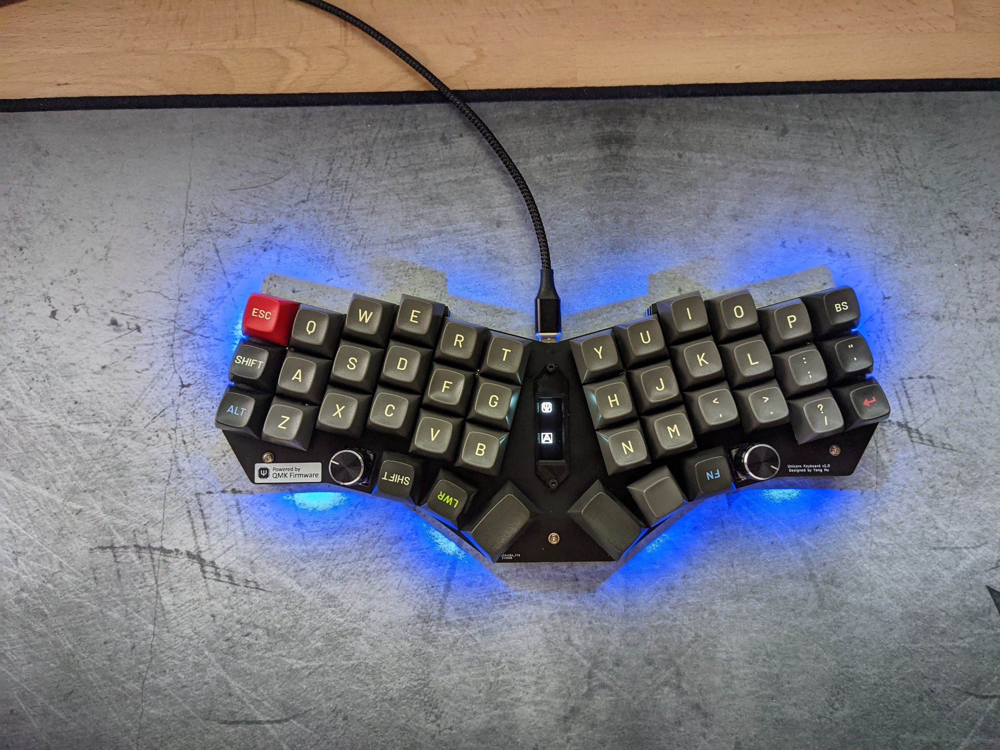

# Unicorne - A single-piece 40% ortho keyboard inspired by Corne and more.

This is the keyboard design files for my own use, inspired by
[crkbd](https://github.com/foostan/crkbd),
[Kyria](https://blog.splitkb.com/blog/introducing-the-kyria) and
[Ferris](https://github.com/pierrechevalier83/ferris), as well as
[Reviung41](https://github.com/gtips/reviung) and others.

The name means "uni(fied)corne".

## Summary of board features

* USB-C connector
* Audio buzzer
* Rotary encoder x 2 (optional)
* Underglow RGB LEDs x8
* SMT32 MCU (STM32F411)
* OLED display
* Column stagger similar to Kyria.
* Corne-style thumb cluster with extra inner key: I feel Kyria's thumb cluster 
is too much and the outer column is hard to reach for me. 
* Thumb cluster shifted 0.25u to the middle.

## Links

* [PCB repo](unicorne-mx/unicorne).
* [PCB ibom
](https://yanghu.github.io/unicorne/artifacts/ibom/unicorn-ibom.html)
* [Fabrication files and firmware](https://github.com/yanghu/unicorne/releases/tag/v1.0)
* [QMK firmware repo](https://github.com/yanghu/qmk_firmware/tree/unicorne/keyboards/yanghu/unicorne).
* [Build guide](https://github.com/yanghu/unicorne/wiki/Build-guide)

## Why I designed this board

I like the simplicity of Corne, however, the more aggresive column stagger
on Kyria suits my hand better. I also removed the use of pro micro boards, and
followed Ferris 2.0 with an ARM chip directly on the board.

The initial reason I wanted to design this board is to eliminate the ugly
"add-on" board of promicro. Ferris is nice but I needed a 3x6 with full thumb
clusters as well: portability is not an issue for me.

I initially thought about building a split keyboard, however, after used crkbd
for a while, I missed the simplicity of a one-piece board: it's always symmetric
and has smaller footprint.

I do use a Planck, but *ortho* is not really a good idea on traditional keyboard
layout: the hands are so close and it's awkward to keep hands "vertical": the
wrist really is painful, especially after used to more ergonomic splits.

Reviung-like keyboards really gave me the inspiration. The angle ensures arms
and hands are in line, while you can still use the ortho layout.

Other features are nice and in different designs. I like the buzzer on Planck
that tells you when the keyboard is alive. The small OLED really is useful to
display status information for a programmable board. The encoder can be pretty
versatile.

